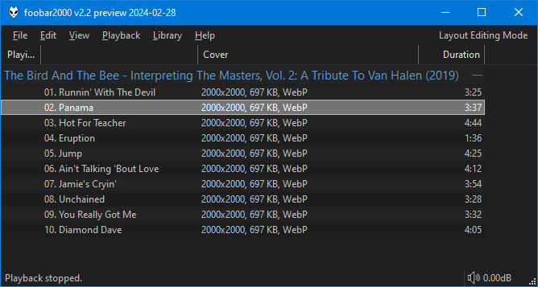

# Cover Utils

!!! important
	This is a combined replacement for `foo_cover_info` and
	`foo_cover_resizer`. If you have either/both installed,
	you must remove them first.

	Note that this uses a separate database for front cover info
	storage so files would need scanning again. Also, different title
	format fields are used for display. See below.

## Requirements
- `foobar2000` `2.24` or later. 32bit and 64bit are both supported.
- `Windows 10` or later

[Download :material-download:](../files/foo_cover_utils-1.3.fb2k-component){ .md-button .md-button--primary }

## Support
https://hydrogenaud.io/index.php/topic,127694.0.html

## Usage
Use the right click menu on any playlist/library selection and you'll find
a `Cover Utils` sub menu.

#### Resize
This option will resize existing embedded art. Reading most common image
types is supported but you must choose `JPG` or `WebP` when saving.

#### Convert without resizing
Converts existing embedded art without resizing. You must choose
`JPG` or `WebP`.

#### Browse for file, resize and attach
This option lets you browse for an image file and will then resize it
before attaching it to the current selection. Images already smaller than
the specified max size will not be processed. You should attach those
via the native [foobar2000](https://www.foobar2000.org) options under the
`Tagging` menu.

#### Browse for file, convert and attach
Use the file picker and then choose to convert the file to `JPG` or `WebP`.

#### Remove all except front
Since most people only want front covers, this is a handy method for
removing all the other types.

#### Scan for info
Because it's not possible to query files for embedded album art within
[foobar2000](https://www.foobar2000.org), you can use this option
to process a selection of files and store the results in a database.

!!! note
	The component automatically tracks all updates to front cover
	properties when using built in methods to add/convert/resize etc.
	It's not possible to track changes from native `foobar2000` album art
	operations so if you do that, files would need re-scanning
	manually.

Data is available in the following fields which are available wherever
title formatting is supported.

|Field||
|---|---|
|`%cover_utils_front_width%`|
|`%cover_utils_front_height%`|
|`%cover_utils_front_format%`|`JPEG`, `PNG`, `WebP`, etc.|
|`%cover_utils_front_size%`|Nicely formatted image size in KB/MB.|
|`%cover_utils_front_bytes%`|Raw image size.|

!!! note
	Database records are attached to the `%path%` of each file. Records
	are preserved if files are renamed/moved with [File operations](https://wiki.hydrogenaud.io/index.php?title=Foobar2000:File_operations).
	If files are renamed/moved externally, records would be orphaned and the files would need
	scanning again.

	Records have a lifetime of 4 weeks if they are
	not included in the `Media Library` or playlist.

!!! Example
	Here's a custom column configuration that would show all information
	if present.

	```
	[%cover_utils_front_width%x%cover_utils_front_height%, %cover_utils_front_size%, %cover_utils_front_format%]
	```

	

	You can also perform playlist/library searches using [query syntax](https://wiki.hydrogenaud.io/index.php?title=Foobar2000:Query_syntax) like this:

	```
	%cover_utils_front_width% PRESENT
	```

#### Clear cover info
This clears all existing info for the current selection.

## Changes

### 1.3
- Update `WebP` encoder to latest version.
- Other internal improvements.

### 1.2
- Fix compatibility with future versions of `foobar2000`.

### 1.1
- Bump minimum requirements to `foobar2000` `2.24` and `Windows 10`.
- Compiled with the latest `foobar2000` `SDK`.

### 1.0
- Initial release
