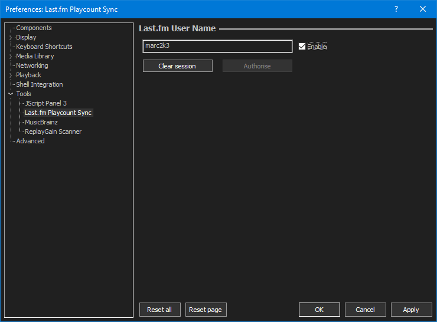
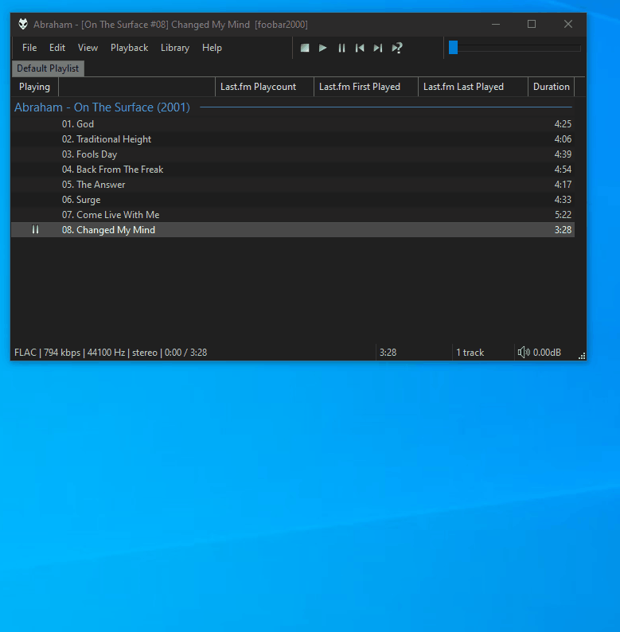

# Last.fm Playcount Sync

!!! note
	No download provided as some whiney little fuckers think it's infected.

## Overview
This component fetches [Last.fm][] playcounts and first played/last played dates
as you listen. A database is used to store the data so your files are not
touched.

This does not scrobble so you'll need another component for that. It's
recommended that you use [foo_scrobble](https://github.com/gix/foo_scrobble).

Additionally, you can also love/unlove tracks. This requires [authorisation](#authorisation).

!!! note
	All lookups / storage are based on `$lower($meta(artist,0) - %title%)` with
	no consideration for album tags. This generally means the numbers will match
	anything you see on [Last.fm][] track pages/charts but you won't get the
	album stats you get from diving deeper in to your [Last.fm][] `Library`.

## Usage
Open `File>Preferences>Tools>Last.fm Playcount Sync` and enter your [Last.fm][] username.

### Authorisation
!!! note
	Using default [Last.fm][] privacy settings, you don't need to
	authorise your account for fetching playcount data.

	If you prefer, you can update your privacy settings to
	`Hide recent listening information`. This requires
	authorisation.

	You also need to authorise your account if you want to love
	or unlove tracks.

To start, click the `Authorise` button. This will launch a browser window
opening the [Last.fm][] website and you must grant
permission for this application **BEFORE** clicking the confirmation
dialog that opened at the same time as your browser.

When `Authorisation` is complete, you should receive final confirmation. If
you revoke permission or change your password on [Last.fm][],
you'll need to use the `Clear session` button and `Authorise` again.

### Updating playcounts
Simply listen and it will update in real time. A lookup is performed a
few seconds after playback starts and assuming the server response is
valid, all existing values for that track will be overwritten
by [Last.fm][] data. Server values always take precedence!

When you've listened to enough of a track for a count to scrobble, the
playcount is incremented by one and the last played date is set. This is
the only time data is written without contacting [Last.fm][]
because most scrobblers won't submit until after the track has finished.

If you can't wait to listen your tracks normally, you can batch import
up to 100 tracks at a time... just like this.

### Available fields

You can configure custom playlist colums or anything else that supports
title formatting to display the following:

||Field||
||---|---|
||`%lfm_playcount%`||
||`%lfm_first_played%`|`YYYY-MM-DD HH:MM:SS`|
||`%lfm_last_played%`|`YYYY-MM-DD HH:MM:SS`|
|:octicons-tag-24: 2.1.3|`%lfm_first_played_ts%`|Unix timestamp|
|:octicons-tag-24: 2.1.3|`%lfm_last_played_ts%`|Unix timestamp|
|:octicons-tag-24: 2.1.3|`%lfm_now%`|`YYYY-MM-DD HH:MM:SS`|
|:octicons-tag-24: 2.1.3|`%lfm_now_ts%`|Unix timestamp|
|:octicons-tag-24: 2.1.3|`%lfm_first_played_ago%`||
|:octicons-tag-24: 2.1.3|`%lfm_last_played_ago%`||

### Loving / unloving tracks
You can `Love` or `Unlove` by right clicking a track (or selection up to 20 tracks)
and using the appropriate menu item. You may consider binding buttons
or keyboard shortcuts.

Note that values are only updated on a successful response from [Last.fm][].

|Field||
|---|---|
|`%lfm_loved%`|Set to `1` if a track is loved. The field will be missing if not.|

### Importing loved tracks
Use the main menu `Library>Last.fm Playcount Sync>Import Last.fm loved tracks`.
Matches will be made against tracks that are monitored as part of the
`Media Library`. Check the `Console` for full results.

### Importing / exporting data
From the main menu `Library>Last.fm Playcount Sync`, you can import/export as
`JSON` for easy transfer to another install or just for backup purposes.

### Errors
Any `Authorisation` errors are reported by popup dialogs. Any errors
updating playcounts, importing loved tracks or loving/unloving tracks
are reported in the `Console`.

## Changes

### 2.4
- Minor bug fixes.

### 2.3
- Internal improvements

### 2.2
- Bump minimum requirements to `foobar2000` `2.24` and `Windows 10`.
- Compiled with the latest `foobar2000` `SDK`.

### 2.1.6
- This  fixes an issue where bulk operations spammed `foobar2000` with
notifications to update playlists/library viewers after every web request
which is not good practice. It now happens once when all web requests have completed.

### 2.1.5
- Loved track import failures are now reported in the `foobar2000` `Console` by artist and
title. Previously, only a count of the successful imports was logged.

### 2.1.4
- Add main menu option to import `Last.fm` loved tracks without resetting existing loved tracks first.

### 2.1.3
- Add some new [title format fields](#available-fields).

### 2.1.2
- The minimum requirement is now `foobar2000` `2.1`.
- Compiled with the latest `foobar2000` `SDK`.

### 2.1.1
- Minor fixes.

### 2.1.0
- Large rewrite.

### 2.0.12
- Database tweaks.

### 2.0.11
- Attempts have been made to possibly fix a multi-threading issue on startup.

### 2.0.10
- `2.0.9` was updated to use code from the latest `foobar2000` `SDK` but the loved track import would crash on `foobar2000` `2.0 Beta 17` and earlier. The change has been reverted so it works on any version.

### 2.0.9
- Compiled with the latest `foobar2000` `SDK`.

### 2.0.8
- Compiled with the latest `foobar2000` `SDK`.
- Import / export improvements.

### 2.0.7
- Fix `Library` menu bug which prevented import/export of data when the `Preferences` were not enabled.

### 2.0.6
- Add extra sanity check when reading metadata to prevent crashes.

### 2.0.5
- Allow users to fetch playcounts with their recent listening history hidden. Requires authorisation.

### 2.0.4
- Adds data import/export as `JSON` from the `Library` menu.

### 2.0.1 - 2.0.3
- Various bug fixes.

### 2.0.0
- Initial release

[Last.fm]: https://last.fm
