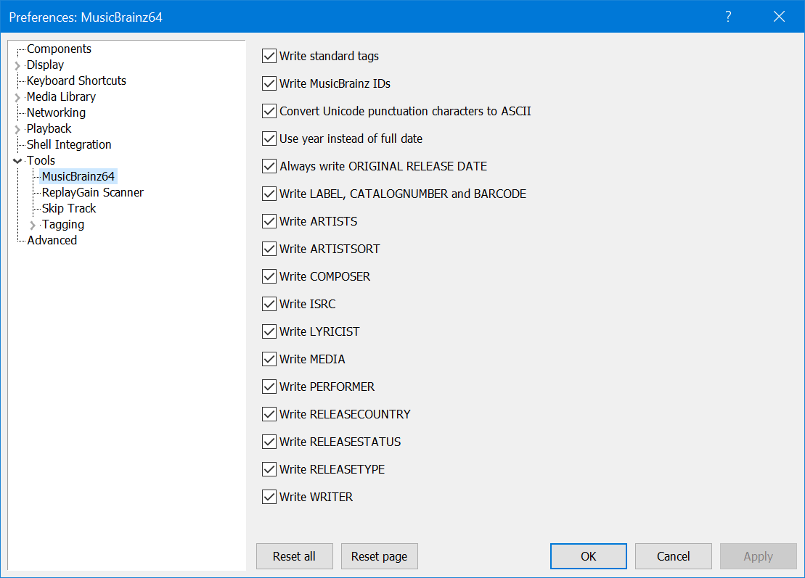
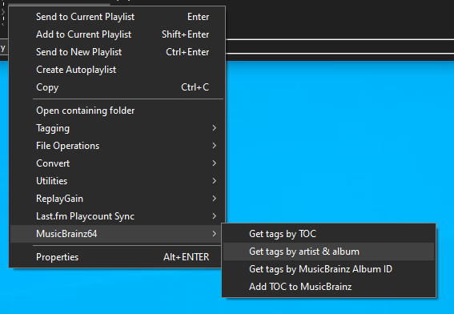

# MusicBrainz64

## Requirements
- `foobar2000` `2.24` or later. 32bit and 64bit are both supported.
- `Windows 10` or later

[Download :material-download:](../files/foo_musicbrainz64-2.9.fb2k-component){ .md-button .md-button--primary }

## Support
https://hydrogenaud.io/index.php/topic,123563.0.html

## Tag Mapping
Before you consider using this to tag your files, it's important to note that it does
not strictly adhere to the `Picard` tag mappings as documented [here](https://picard-docs.musicbrainz.org/en/appendices/tag_mapping.html).

If compatibility with `MusicBrainz Picard` or other taggers/players that make use of `MBID` data is
more important then you should probably avoid using this. More details of what this component
does and why can be found [below](#the-nerdy-stuff).

## Preferences
These can be found under `File>Preferences>Tools>MusicBrainz`.

## Usage
This is very much a `dumb` tagger. You can only tag complete `releases` (or release
[mediums](https://musicbrainz.org/doc/Medium)) and all tracks must be in the same
order as they appear on [MusicBrainz](https://musicbrainz.org).

If you have incomplete releases, for example 2 discs out of 3, you'll need to update each
disc individually.

You can right click any selection of tracks from a playlist or library viewer and
use one of these 4 commands.

The `TOC` options only appear if the selected tracks are sourced from a CD rip. This is determined by
their exact length so if you've used an inferior CD ripper like `Window Media Player`, your
CD rips may not have these options.

The first option looks up releases by a `discid` calculated from the combination of track
count/lengths. If no matches are found, it's possible the `release` does exist on `MusicBrainz`
but no one has attached a `discid` just yet.

!!! note
	When performing a `Get tags by TOC` lookup, `LYRICIST`, `WRITER`, `PERFORMER` and `COMPOSER`
	are not available.

You can use the 2nd option to search for releases by `Artist` and `Album` name.

The 3rd option will let you do a more precise search by `MusicBrainz Album ID` if you know exactly
which release you want to use or if you've tagged the files before, an existing value will be read.

You may paste full release URLs in to the popup dialog and the server address will be stripped away.

When one or more matching `releases` have been found, you'll be presented with the main
`Tagger Dialog` ([screenshot](../images/musicbrainz-tagger.png)).

From here, you can choose the best match for your selection. Note that while multiple releases
may match your selection count, they may have differing track orders and entirely different
tracks depending on region. Sometimes, the `release` from your country of origin may be
the `worst` match and you'll have to pick another! The `releases` list is read-only
but you can edit all other text fields and the `Title` column in the track list.

In the `Disc Subtitle` column, you can only edit the entry for track 1 of each disc. Edits
will be applied to all tracks from the same disc when tagging.

## TOC submissions
You should only use the `Add TOC to MusicBrainz` option if you are a [MusicBrainz](https://musicbrainz.org)
editor and the selection is an actual `CD` in an optical drive. Submitted `discids` must be calculated
from sources that take `pregap` information in to account. This simply is not present in ripped files.

## The Nerdy Stuff
When it comes to tagging `MBID`s, this component always follows the naming conventions used for `Vorbis`
comments regardless of the underlying file format/tagging sheme.

For example, it will write `MUSICBRAINZ_ARTISTID` instead of `MUSICBRAINZ ARTIST ID` to `MP3` and `M4A` files.
Repeat that for all tags prefixed with `MUSICBRAINZ`.

The following differences affect `ID3` tagging only:

- `DISCSUBTITLE` is written to `TXXX:DISCSUBTITLE` rather than `TSST (SET SUBTITLE)`
- `LABEL` is written to `TXXX:LABEL` rather than `TPUB (PUBLISHER)`
- `MEDIA` is written to `TXXX:MEDIA` rather than `TMED (MEDIA TYPE)`
- `MUSICBRAINZ_RECORDINGID` is written to `TXXX:MUSICBRAINZ_TRACKID` rather than `UFID://musicbrainz.org`
- `RELEASECOUNTRY` is written to `TXXX:RELEASECOUNTRY` rather than `TXXX:MUSICBRAINZ ALBUM RELEASE COUNTRY`
- `PERFORMER` is written to `TXXX:PERFORMER` rather than `TMCL` / `IPLS`

The reasoning for this is twofold:

- `foobar2000` has never been able to read or write certain frames like `UFID` / `TMCL` / `IPLS`.
- And for frames that are recognised, it unifies tag display/search regardless of file format.
It's easier to search for `%LABEL% IS blah` rather than `%LABEL% IS blah OR %PUBLISHER% IS blah` which
is what you'd have to do if this was `Picard` compatible.

The main exception to the above is that `ARTISTSORT` and `ALBUMARTISTSORT` will be written differently depending
on format. See the changelog entry for [1.1.2](#112).

## Changes

### 2.9
- Minor bug fixes.

### 2.8
- Fix `PERFORMER` bug where `guest`/`additional` attributes may have been written without specifying
`vocal` or an instrument. Apologies for any inconvenience this may have caused.

### 2.7
- Fix multi-value sorting bug affecting `COMPOSER`/`WRITER`/`PERFORMER`.

### 2.6
- Bump minimum requirements to `foobar2000` `2.24` and `Windows 10`.
- Compiled with the latest `foobar2000` `SDK`.

### 2.5
- Fix bug where `ORIGINAL RELEASE DATE` could be written even when the preferences were disabled.

### 2.4
- Fix tagger dialog bug where the `Track Artist` could not be previewed/edited before writing. Just to be clear,
this only appears on various artist releases.

### 2.3
- [Work](https://musicbrainz.org/doc/Work) relationships are now parsed which adds support for writing `LYRICIST`
and `WRITER` tags. Check the main `Preferences>Tools>MusicBrainz64` if you wish to disable this. It should also
improve coverage for `COMPOSER`.
- Improve `PERFOMER` handling to include more vocalists.

### 2.2
- Fix crash on shutdown which did not provide any popup but may have left crash dumps in your profile folder.
These should be deleted to avoid confusion in the future. Apologies for the inconvenience.

### 2.1
- Add support for `32bit`. The name is remaining unchanged.
- For existing `64bit` users, all preferences have been reset due to a large internal rewrite at the same time. 

### 1.2.9
- Fix bug where ascii punctuation replacements were not applied if enabled in the `Preferences`. I can only apologise
for the inconvenience this may have caused.
- `v1.1.2` added support for writing `ARTISTSORT` and `ALBUMARTISTSORT` and it was clearly stated that `foobar2000`
would transform these to `ARTISTSORTORDER` and `ALBUMARTISTSORTORDER` when tagging `mp3`/`m4a`. Unfortunately
I did not notice that this would not clear any existing `ARTISTSORTORDER` and `ALBUMARTISTSORTORDER` values
so if you tagged the same tracks more than once, values would be appended instead of overwriting. This is now fixed.

### 1.2.8
- Fix displaying/editing the disc subtitle for single disc releases.

### 1.2.7
- No changes in functionality from previous release but some code has been modernised.

### 1.2.6
- Use `;` as multi-value separator when editing `LABEL`, `CATALOGNUMBER` and `Secondary Types` in the tagger dialog.

### 1.2.5
- Fixes a bug where the `Disc Subtitle` column was recently enabled for single disc releases but the value was not written unless it was a multi-disc release.

### 1.2.4
- Fixes a bug introduced in `1.2.3` where a `PERFORMER` credited with the same `instrument` at `recording` and `release` level would see that `instrument` duplicated.

### 1.2.3
- `COMPOSER` and `PERFORMER` from the `recording` level are now supported. The original implementation only supported `release` level.

### 1.2.2
- `CATALOGNUMBER` and `LABEL` can now be multi-value. Previously, only the first value was written.

### 1.2.1
- Minor bug fix.

### 1.2.0
- All new options are enabled by default. Always check `File>Preferences>Tools>MusicBrainz`. Previous settings for existing users should be preserved.
- Support for writing `PERFORMER` and `COMPOSER` tags has been added. Note that these are not available when performing `Get tags by TOC` lookups.
- When writing `PERFORMER` to `MP3`, multi-value `TXXX` frames are used. This is because `foobar2000` has never supported `TMCL` / `IPLS`.

### 1.1.2
- Support for writing `ARTISTSORT` was added, it's off by default. `ALBUMARTISTSORT` will be written for various artist albums.
    - Note that `foobar2000` will automatically transform these to `ARTISTSORTORDER` and `ALBUMARTISTSORTORDER` when writing to `MP3`/`M4A`. Component authors cannot control this.
    - For `MP3`, they are written to the `TSOP` and `TSO2` frames as detailed [here](https://wiki.hydrogenaud.io/index.php?title=Foobar2000:ID3_Tag_Mapping).

### 1.1.1
- Fix regression in `1.1.0` where the state of the `Preferences` `Apply` button did not update to reflect when changes had been made.

### 1.1.0
- Support for writing multi-value `ARTISTS` has been added. It's off by default so check the `Preferences`.
- An option to always write `ORIGINAL RELEASE DATE` has been added. Previously, it was only written if it differed from `DATE`.

### 1.0.2
- `RELEASETYPE` now supports multiple values.

### 1.0.1
- Fix crash caused by not using new `SDK` methods correctly.

### 1.0.0
- All dialogs have been updated to support `Dark Mode`.
- Some `Preferences` have been updated.
