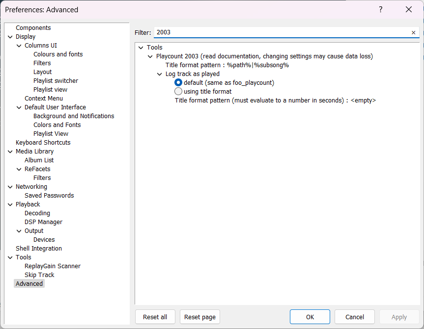
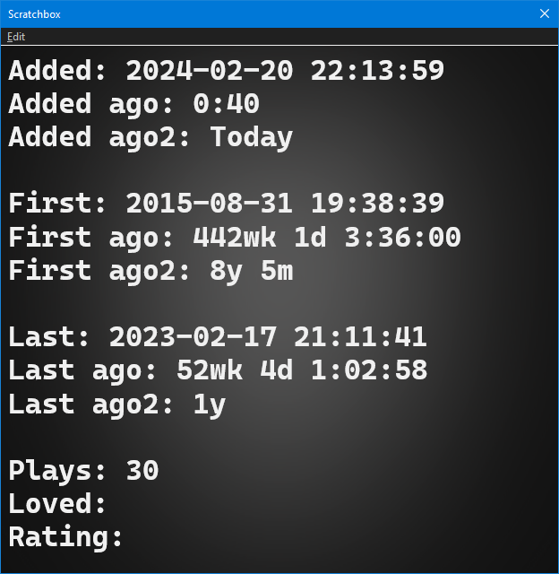

# Playcount 2003
!!! note
	If you're using `0.3.0` or earlier with `Advanced` mode enabled, you must not update to
	this version as it will cause data loss.

	Updating from older versions in `Simple` mode is fine and existing data will be preserved.

[Download :material-download:](../files/foo_playcount_2003-1.4.fb2k-component){ .md-button }

## Overview
This component uses the same database backend that `foo_playcount` utilises
for logging plays but has many more advanced features and fewer limitations.

- Playcounts and dates can edited for any context menu selection.
- Data can be imported from file tags or fields provided by other components.
- Ratings up to 10 are supported.
- You can customise how long you have to listen before a play count is incremented.
- The current time is available via title formatting as a full date time string or Unix timestamp.
- First played, last played and added are all available as Unix timestamps.
- How records are bound to tracks can be configured in the `Advanced Preferences`.

## Advanced Preferences
The first thing you'll want to do after installing this is check `File>Preferences>Advanced>Tools>Playcount 2003`.



!!! note
	It's important that the title format pattern is decided on before starting as any change causes immediate data loss.
	`foobar2000` will prompt you to restart when changing that setting.

### Title format pattern
This is how database records are bound to your tracks. The default of `%path%|%subsong%` does
mean every track will have unique data.

!!! note
	Using the default pattern, statistics can survive files being moved or copied when using [file operations](https://wiki.hydrogenaud.io/index.php?title=Foobar2000:File_Operations_(foo_fileops)) but
	cuesheets/other tracks with multiple chapters are not supported. If that is not acceptable,
	you should change it to a pattern that makes use of tags instead. You might consider a pattern like

	```
	%album artist%|%album%|%date%|%discnumber%|%artist%|%tracknumber%|%title%
	```

### Log track as played
The default is to use the same rules as `foo_playcount`. This means you have to listen to at least 1 minute for it to count. If the track is shorter than one minute, you have to listen to all of it.

Now you can customise the time in seconds by entering a number or making it dynamic by using title formatting. If the title format pattern does not evaluate to a number, the track won't be logged.

You must take care to cover every scenario because there is no safety net. For example if you enter `30`, no track shorter than that will ever count.

Therefore you should consider using `%length_seconds%`.

!!! example
	``` markdown title="20%"
	$div(%length_seconds%,5)
	```

	``` markdown title="Half the track length or 30 seconds, whichever is lower."
	$if(%length_seconds%,$min($div(%length_seconds%,2),30),)
	```

	``` markdown title="The whole track"
	$sub(%length_seconds%,1)
	```

!!! note
	For this last example, you cannot use `%length_seconds%` on its own because lengths may be rounded up
	and the counter will never reach it.

## Available fields
These fields are available globally in `foobar2000` in any playlist columns/search/3rd party panel.

``` markdown title="Full date/time strings"
%2003_now%
%2003_added%
%2003_first_played%
%2003_last_played%
```

``` markdown title="Unix timestamps (number of seconds since 1st January 1970)"
%2003_now_ts%
%2003_added_ts%
%2003_first_played_ts%
%2003_last_played_ts%
```

```markdown title="Numbers"
%2003_playcount%
%2003_loved%
%2003_rating%
```

```markdown title="Calculated difference since now, formatted in weeks, days, hours, minutes, seconds"
%2003_added_ago%
%2003_first_played_ago%
%2003_last_played_ago%
```

```markdown title="Calculated difference since now, formatted in years and months. Weeks and days are only shown if less than one year"
%2003_added_ago2%
%2003_first_played_ago2%
%2003_last_played_ago2%
```

!!! example
	```
	Added: %2003_added%
	$crlf()
	Added ago: %2003_added_ago%
	$crlf()
	Added ago2: %2003_added_ago2%
	$crlf()
	$crlf()
	First: %2003_first_played%
	$crlf()
	First ago: %2003_first_played_ago%
	$crlf()
	First ago2: %2003_first_played_ago2% 
	$crlf()
	$crlf()
	Last: %2003_last_played%
	$crlf()
	Last ago: %2003_last_played_ago%
	$crlf()
	Last ago2: %2003_last_played_ago2%
	$crlf()
	$crlf()
	Plays: %2003_playcount%
	$crlf()
	Loved: %2003_loved%
	$crlf()
	Rating: %2003_rating%
	```

	

Ratings and loved values are set via the context menu for any playlist/library selection.

### Added
`Added` times are generated automatically for `Media Library` items only. This happens when `foobar2000`
starts or when new library items are added. If you clear data via the context menu, the `Added` field
will remain empty until the next restart or the next play or import.

`Added` dates can be edited via the context menu. Selecting this option will open an edit
dialog where you can update it using any valid date/time string in `YYYY-MM-DD HH:MM:SS` format.
The component will not check if selection items belong to the library when writing.

!!! note
	Strictly speaking, the earliest supported date/time is `1970-01-01 00:00:01`. As Unix timestamps are used
	internally, zero is reserved for indicating not set. The latest value is some time in the year 2106
	because 32bit unsigned integers are used for storage.

## Editing
The main `Edit` dialog found under the context menu > `Playcount 2003>Edit` now supports `Presets` and
you can import data from `foo_playcount` or `foo_lastfm_playcount_sync` as illustrated here:


In addition to `Presets`, you can fill in values manually or use title formatting to import data from tags/other
components.

## Data import / export
You can import/export data either via the main menu > `Library>Playcount 2003` or use the context menu
on any playlist/library selection. When importing, files must be `UTF8`. With or without `BOM` is
fine. Exported files are always without `BOM`.

## Data retention
Database records are remembered for 4 weeks when not monitored as part of the `Media Library` or any loaded playlist. This behaviour is the same as `foo_playcount`.

## Changes

### 1.4
- Fix stupid bug introduced in `1.3`.

### 1.3
- Internal improvements.

### 1.2
- Bug fixes.

### 1.1
- Minor bug fixes.

### 1.0
- Remove `Advanced` mode. The previous version with this is still available for download [here](playcount-2003-legacy.md).
- Add menu items to increment/decrement ratings for the current selection.
