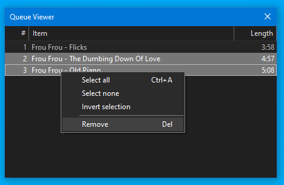

# Queue Viewer

## Requirements
- `foobar2000` `2.25` or later. 32bit and 64bit are both supported.
- `Windows 10` or later

[Download :material-download:](../files/foo_queue_viewer-1.6.fb2k-component){ .md-button .md-button--primary }

## Support
https://hydrogenaud.io/index.php/topic,123942.0.html

## Overview
This provides full playback queue management as an embedded UI element for `Default UI`
and `Columns UI`. There is also a standalone popup window available from the `View` menu.

There is full drag/drop support from other playlist / library viewer selections. You
can select single or multiple items to re-arrange or remove them entirely.

Unlike the original `foo_queuecontents` component, there is no support for multiple columns
but the `Item` column supports custom title formatting.



By right clicking on the column headers, you can set the title format pattern used
for the `Item` column, choose to `Keep queue on close` and sort the entire queue
by randomising or reverse.

## Usage
It is assumed you know how to add UI elements to your layout. Basic guides
can be found below.

[Default UI](http://wiki.hydrogenaud.io/index.php?title=Foobar2000:Layout_Editing_Mode)

[Columns UI](https://wiki.yuo.be/columns_ui:config:layout)

In addition to the drag/drop capabilities mentioned above, you can also right click any
playlist or library selection and use these new commands found under the `Queue Viewer` sub-menu:

```
Send to playback queue
Send to playback queue and play
Add to front of playback queue
Add to front of playback queue and play
```

The `Send` commands flush exisiting queue items first.

!!! note
	If menu items appear to be hidden, it's because the queue is limited to a maximum of 256
	tracks.

## Changes

### 1.6
- Fix rare crash.
- `foobar2000` `2.25` is the new minimum requirement.

### 1.5
- Holding ++shift++ when choosing any `Queue Viewer` context menu item randomises
the selection before queuing.

### 1.4
- Minor bug fixes.
- Update to latest `foobar2000` and `Columns UI` `SDK`.

### 1.3
- Fix dark mode toggle glitch.
- Update to latest `Columns UI` `SDK`.

### 1.2
- Fix various bugs including queue items not responding to underlying file tags being edited.

### 1.1
- Bump minimum requirements to `foobar2000` `2.24` and `Windows 10`.
- Compiled with the latest `foobar2000` `SDK`.

### 1.0.26
- The minimum requirement is now `foobar2000` `2.1`.
- Compiled with the latest `foobar2000` `SDK`.

### 1.0.25
- Fix bug where `foobar2000` keyboard shortcuts were suppressed if this panel had focus. This affected `Columns UI` only.

### 1.0.24
- Restore alternate line shading for `Default UI` elements.

### 1.0.23
- Improve UI colour handling.

### 1.0.22
- Code cleanup.

### 1.0.21
- Check dropped items and restored items against the active playlist to make `%queue_index%` available if possible.

### 1.0.20
- Viewer settings must now be set by right clicking the column header. Right clicking queue items
only shows options relevant for the selection.

### 1.0.19
- ~~Hopefully fix column header redraw glitch when toggling between dark and light modes in `Default UI`.~~

### 1.0.18
- ~~Add random / reverse sort options to the viewer instance right click menu. They always apply
to the whole queue, not the selection.~~

### 1.0.17
- Fix bug where the existing queue item count was not considered for displaying/hiding the
new context menu options added in `1.0.16`.

### 1.0.16
- Add new context commands for adding playlist / library viewer selections to the front of
the queue while keeping existing queue items.

### 1.0.15
- Make `%queue_index%` available when using the context menu `Send` options on `Library`
selections that are also present in the active playlist.
- Remove auto-scroll workarounds and use the latest `foobar2000` `SDK` which fixes previously
reported issues.

### 1.0.14
- Add support for themed style to match `Default UI` and `Columns UI` playlists.

### 1.0.13
- Implement auto-scrolling when drag/dropping over the top/bottom of the list.

### 1.0.12
- Improve UI colour handling.

### 1.0.11
- Fixes an issue where using the context menu to send active playlist items to the queue
wasn't handled in the special way needed for the `%queue_index%` to be available.

### 1.0.10
- Adds context menu options for sending playlist/library viewer selections to the queue. As
opposed to the existing add command, this flushes existing queue items first. There is also
an option to play immediately.

### 1.0.9
- Fixes a bug where the column header font was not set correctly.

### 1.0.8
- You can now customise the title formatting used for the `Item` column. Use the option
found on the right click menu.

### 1.0.7
- Fixes a bug where the selection state of moved items was not preserved.

### 1.0.6
- Add toggle for keeping the queue when `foobar2000` is closed. For this to work, a file named
`foo_queue_viewer.fpl` is saved in the root of your `foobar2000` profile folder. It will
be used to restore the queue on the next start. Note that this option is off by default.

### 1.0.5
- Fix bug when using the `Default UI` `System Default` theme in certain scenarios.

### 1.0.4
- Add support for drag/dropping playlist/library viewer selections on to the window.

### 1.0.3
- Add a popup window to the main `View` menu.

### 1.0.2
- Fix a bug in `1.0.1` which would cause a crash if the queue was active before adding a panel to a layout.
