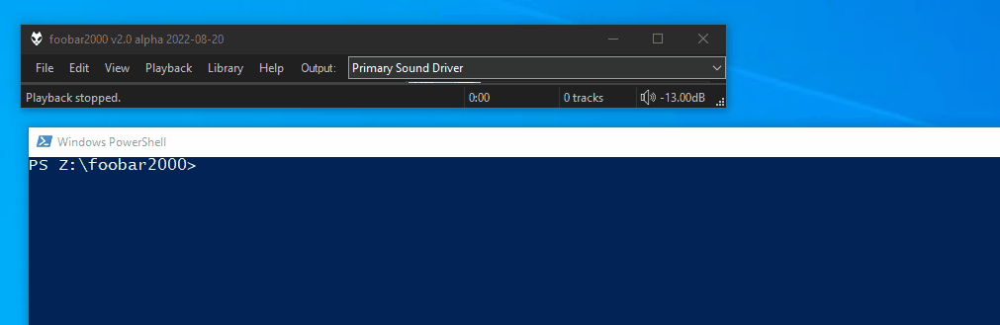

# Run Main

## Requirements
- `foobar2000` `2.24` or later. 32bit and 64bit are both supported.
- `Windows 10` or later

[Download :material-download:](https://github.com/marc2k3/fb2k-graveyard/raw/refs/heads/main/files/foo_run_main-1.1.0.fb2k-component){ .md-button .md-button--primary }

## Overview
This component is for executing main menu commands via the command line.

While `foobar2000` itself has a command line handler built in, it is less useful
because:

- it does not support dyanmically generated menu commands
- it cannot disambiguate between menu item names that might appear more
than once under different sub-menus.

This component address both of those issues meaning you can use it to
switch playlists or audio devices:



## Usage
To avoid the ambiguity issue mentioned above, you must supply the full path to the command.

!!! example
	```
	foobar2000.exe /run_main:Edit/Sort/Randomize
	foobar2000.exe /run_main:Library/Search

	// use double quotes when command contains spaces
	foobar2000.exe /run_main:"Playback/Device/Primary Sound Driver"
	```

## Changes

### 1.1.0
- Bump minimum requirements to `foobar2000` `2.24` and `Windows 10`.
- Compiled with the latest `foobar2000` `SDK`.

### 1.0.4
- The minimum requirement is now `foobar2000` `2.1`.
- Compiled with the latest `foobar2000` `SDK`.
