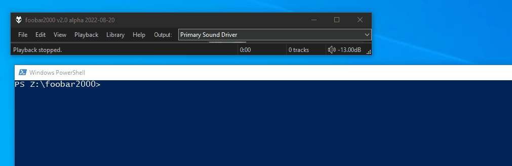

# Run Main

## Requirements
- `foobar2000` `2.24` or later. 32bit and 64bit are both supported.
- `Windows 10` or later

[Download :material-download:](../files/foo_run_main-1.1.0.fb2k-component){ .md-button }

## Overview
Unlike the built in command line handler/`foo_runcmd`, this component has
full support for dynamically generated menu commands meaning you can
use `Edit` commands and switch playlists, change output devices etc.



## Usage

To avoid ambiguity with common names that might appear more than once
under different sub menus, you must supply the full path to the command.

!!! example
	```
	foobar2000.exe /run_main:Edit/Sort/Randomize
	foobar2000.exe /run_main:Library/Search

	// use double quotes when command contains spaces
	foobar2000.exe /run_main:"Playback/Device/Primary Sound Driver"
	```

## Changes

### 1.1.0
- Bump minimum requirements to `foobar2000` `2.24` and `Windows 10`.
- Compiled with the latest `foobar2000` `SDK`.

### 1.0.4
- The minimum requirement is now `foobar2000` `2.1`.
- Compiled with the latest `foobar2000` `SDK`.
